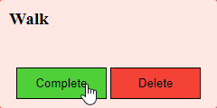

# JS Academy Test

## Getting started

 -  fork this repository to your GitHub account
 -  clone the forked repository to your computer
 -  commit frequently with descriptive messages
 -  format your code according to the style guide
 -  **do not push** your work to GitHub until a mentor announces that the time
    is up

## What can I use?

 -  You can use any online and offline resource but **work individually**

## Tasks

Your task will be to create a full stack TODO web application.

### Implement the API

 -  implement the [TODO API](api-documentation.md) in Node.js
     -  use Express and MongoDB
 -  use `.gitignore` to ignore the unnecessary files and folders

### Create the Frontend

### Serve your frontend

Use Express to host your frontend. (If the server is running and I navigate to
the "/" path I should see the result of the previous exercise.)

### Question time

#### What is the difference between id and class in CSS?

[add your answer here]
